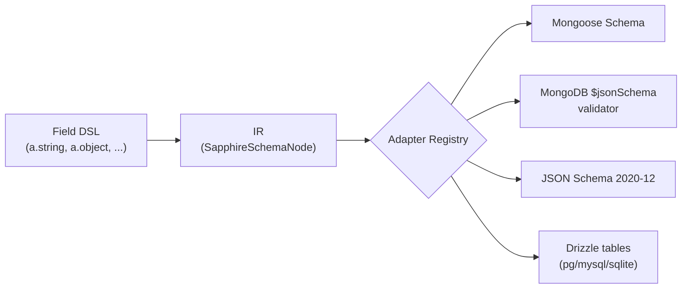

# Architecture

Sapphire is organized as three layers with a strict boundary between them: a fluent **Field DSL** that you write, an **intermediate representation (IR)** that every field normalizes to, and an **adapter registry** that turns IR nodes into ORM-specific outputs. The DSL is ergonomic and TypeScript-aware; the IR is flat, JSON-serializable, and free of TS types; the adapters are pure functions. New adapters slot in without touching core.

## Flow



## Components

| Package                                | Responsibility                                                                                                                                                 |
| -------------------------------------- | -------------------------------------------------------------------------------------------------------------------------------------------------------------- |
| `@ascendance-hub/sapphire-core`        | Field DSL, IR, validation (`parse`/`safeParse`), `Infer<>`/`InferInput<>` types, adapter registry, named-schema registry, message resolver. Zero runtime deps. |
| `@ascendance-hub/sapphire-mongoose`    | Mongoose adapter. Walks the IR and emits a `mongoose.Schema`.                                                                                                  |
| `@ascendance-hub/sapphire-bson`        | Native MongoDB driver adapter. Walks the IR and emits a `$jsonSchema` collection validator.                                                                    |
| `@ascendance-hub/sapphire-json-schema` | JSON Schema 2020-12 adapter. Emits a `$defs` collector with `$ref` cycles supported.                                                                           |
| `@ascendance-hub/sapphire-drizzle`     | Drizzle adapter. Emits `pgTable` / `mysqlTable` / `sqliteTable` with lazy `references()` for refs.                                                             |

## Data flow — a worked example

Consider this schema:

```ts
const a = new Sapphire()
const User = a.object({ name: a.string().min(3) }).name('User')

const ir = User.toSchema()
const mongoSchema = User.getSchema('mongoose')
```

What happens at each step:

1. **`a.string().min(3)`** instantiates a `StringField` and stores `minLength: 3` in its internal state. The call returns a new immutable field; the original is untouched.
2. **`a.object({ name: ... })`** instantiates an `ObjectField` carrying a generic `T extends Record<string, Field>` so composition methods (`pick`, `omit`, `partial`, `required`, `extend`, `merge`) stay typed against the actual shape.
3. **`.name('User')`** registers the ObjectField in the Sapphire instance's `NamedSchemaRegistry`. This is what makes the schema reachable by `a.ref('User')` from elsewhere.
4. **`User.toSchema()`** walks the field tree and emits an IR `SapphireSchemaNode`. The result is a flat discriminated union — `{ kind: 'object', name: 'User', properties: { name: { kind: 'string', minLength: 3, required: true } }, required: true }` — with no class instances and no TS types.
5. **`User.getSchema('mongoose')`** looks up the `'mongoose'` adapter in the registry, calls it with the IR node, and returns the adapter's output (a `mongoose.Schema`). The lookup falls back to the instance's `defaultAdapter` when the name is omitted.

The adapter does not see the DSL classes or the original field tree — only the IR. This is the boundary that makes third-party adapters possible.

## Registry boundary

Two registries, both owned by core:

- **`adapterRegistry`** — module-level singleton. `registerAdapter(name, fn)` is called once per adapter at app entry; `getSchema(name?)` resolves through it. Lives in `packages/core/src/adapters/registry.ts`.
- **`NamedSchemaRegistry`** — per-`Sapphire`-instance. Populated by `ObjectField.name(...)`. Resolved lazily by `RefField` at `getSchema()` time (or at query time for Drizzle, see the adapter's docs).

Core also owns the **message resolver** (5-level hierarchy — see [Design decisions](./design-decisions.md)) and the **parse runner** (`parse` / `safeParse` orchestration over the field tree).

Adapters own:

- **IR-walk dispatch.** A `switch (node.kind)` over all 12 variants. Adding an IR kind is a compile-time error at every adapter call site.
- **ORM-specific options.** Each adapter reads `node.meta?.<adapter-name>` for the universal `.adapter(name, opts)` escape hatch (see [`escape-hatch.md`](../concepts/escape-hatch.md)).
- **Output shape.** Mongoose `Schema`, JSON Schema document, Drizzle table — whatever the adapter chooses to return.

## Per-adapter behavior at a glance

- **Mongoose (`@ascendance-hub/sapphire-mongoose`)** — walks the IR into `mongoose.Schema` paths. Unsupported kinds fall back to `Mixed`. Subdocuments use `_id: false` by default. Universal modifiers (`required`, `unique`, `index`, `default`, `enum`) map to Mongoose path options. Escape hatch `meta.mongoose` merges last with `type`/`required` blacklisted.
- **MongoDB native driver (`@ascendance-hub/sapphire-bson`)** — emits a `$jsonSchema` collection validator (`toBsonSchema`) for `db.createCollection(name, { validator })`. Maps IR kinds to `bsonType` names, uses JSON Schema draft-4 exclusive bounds, inlines named objects (no `$ref`), and emits `ref` as `bsonType: 'objectId'`. Escape hatch `meta.bson` merges last.
- **JSON Schema (`@ascendance-hub/sapphire-json-schema`)** — emits 2020-12 (`prefixItems` for tuples, numeric `exclusiveMinimum`). `union` becomes `oneOf` (see [Design decisions](./design-decisions.md)). Named ObjectFields collect into `$defs` and `ref` becomes `$ref: '#/$defs/Name'`. Escape hatch `meta['json-schema']` merges last with `type` and `$ref` blacklisted.
- **Drizzle (`@ascendance-hub/sapphire-drizzle`)** — emits `pgTable` / `mysqlTable` / `sqliteTable` chosen by `options.dialect`. Refs use `references(() => target.id)` via a `DrizzleTableRegistry` so cycles resolve lazily. Escape hatch `meta.drizzle` is interpreted as chained method calls; per-dialect sub-keys (`pg`, `mysql`, `sqlite`) gate calls by dialect. Unknown method names are silently skipped (intentional — see [`escape-hatch.md`](../concepts/escape-hatch.md)).

## See also

- [Design decisions](./design-decisions.md) — why the API looks the way it does.
- [Contributing](./contributing.md) — repo setup and how to write a third-party adapter.
- [Escape hatch](../concepts/escape-hatch.md) — `.adapter(name, opts)` contract.
- [Refs and relations](../concepts/refs-and-relations.md) — named-schema registry and lazy resolution.
