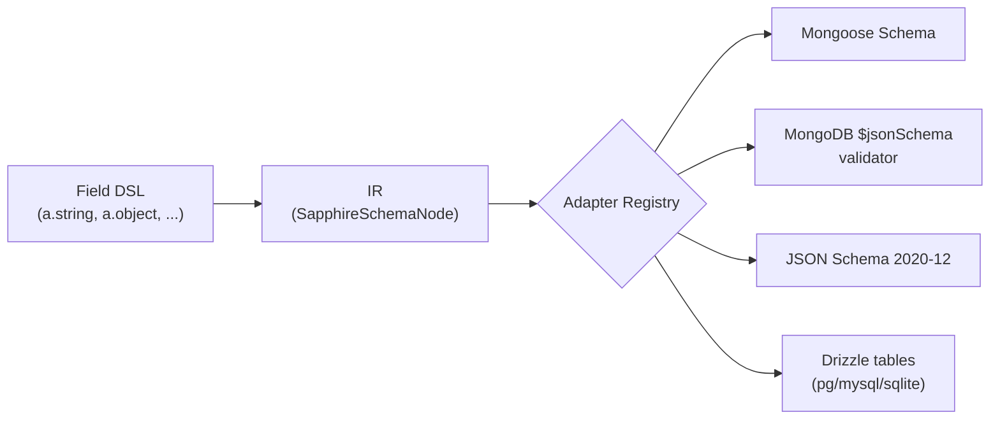

# Arquitetura

O Sapphire é organizado em três camadas com uma fronteira estrita entre elas: um **DSL de Field** fluente que você escreve, uma **representação intermediária (IR)** para a qual todo field se normaliza, e um **registro de adapters** que transforma nós da IR em saídas específicas de ORM. O DSL é ergonômico e ciente do TypeScript; a IR é plana, serializável em JSON e livre de tipos do TS; os adapters são funções puras. Novos adapters se encaixam sem tocar no core.

## Fluxo



## Componentes

| Pacote                                 | Responsabilidade                                                                                                                                                                              |
| -------------------------------------- | --------------------------------------------------------------------------------------------------------------------------------------------------------------------------------------------- |
| `@ascendance-hub/sapphire-core`        | DSL de Field, IR, validação (`parse`/`safeParse`), tipos `Infer<>`/`InferInput<>`, registro de adapters, registro de schemas nomeados, resolvedor de mensagens. Zero dependências de runtime. |
| `@ascendance-hub/sapphire-mongoose`    | Adapter Mongoose. Percorre a IR e emite um `mongoose.Schema`.                                                                                                                                 |
| `@ascendance-hub/sapphire-bson`        | Adapter do driver nativo do MongoDB. Percorre a IR e emite um validador de coleção `$jsonSchema`.                                                                                             |
| `@ascendance-hub/sapphire-json-schema` | Adapter de JSON Schema 2020-12. Emite um coletor de `$defs` com ciclos de `$ref` suportados.                                                                                                  |
| `@ascendance-hub/sapphire-drizzle`     | Adapter Drizzle. Emite `pgTable` / `mysqlTable` / `sqliteTable` com `references()` preguiçosas para refs.                                                                                     |

## Fluxo de dados — um exemplo prático

Considere este schema:

```ts
const a = new Sapphire()
const User = a.object({ name: a.string().min(3) }).name('User')

const ir = User.toSchema()
const mongoSchema = User.getSchema('mongoose')
```

O que acontece em cada passo:

1. **`a.string().min(3)`** instancia um `StringField` e armazena `minLength: 3` no seu estado interno. A chamada retorna um novo field imutável; o original permanece intocado.
2. **`a.object({ name: ... })`** instancia um `ObjectField` carregando um genérico `T extends Record<string, Field>` para que os métodos de composição (`pick`, `omit`, `partial`, `required`, `extend`, `merge`) permaneçam tipados contra o shape real.
3. **`.name('User')`** registra o ObjectField no `NamedSchemaRegistry` da instância Sapphire. É isso que torna o schema alcançável por `a.ref('User')` de outro lugar.
4. **`User.toSchema()`** percorre a árvore de fields e emite um `SapphireSchemaNode` da IR. O resultado é uma union discriminada plana — `{ kind: 'object', name: 'User', properties: { name: { kind: 'string', minLength: 3, required: true } }, required: true }` — sem instâncias de classe e sem tipos do TS.
5. **`User.getSchema('mongoose')`** procura o adapter `'mongoose'` no registro, o chama com o nó da IR e retorna a saída do adapter (um `mongoose.Schema`). A busca recai para o `defaultAdapter` da instância quando o nome é omitido.

O adapter não vê as classes do DSL nem a árvore de fields original — apenas a IR. Essa é a fronteira que torna possíveis os adapters de terceiros.

## Fronteira do registro

Dois registros, ambos pertencentes ao core:

- **`adapterRegistry`** — singleton de nível de módulo. `registerAdapter(name, fn)` é chamado uma vez por adapter na entrada da aplicação; `getSchema(name?)` resolve através dele. Vive em `packages/core/src/adapters/registry.ts`.
- **`NamedSchemaRegistry`** — por instância `Sapphire`. Populado por `ObjectField.name(...)`. Resolvido preguiçosamente por `RefField` no momento de `getSchema()` (ou no momento da query para o Drizzle, veja a documentação do adapter).

O core também é dono do **resolvedor de mensagens** (hierarquia de 5 níveis — veja [Decisões de design](./design-decisions.md)) e do **executor de parse** (orquestração de `parse` / `safeParse` sobre a árvore de fields).

Os adapters são donos de:

- **Despacho da travessia da IR.** Um `switch (node.kind)` sobre todas as 12 variantes. Adicionar um kind de IR é um erro em tempo de compilação em todo local de chamada de adapter.
- **Opções específicas de ORM.** Cada adapter lê `node.meta?.<adapter-name>` para o escape hatch universal `.adapter(name, opts)` (veja [`escape-hatch.md`](../concepts/escape-hatch.md)).
- **Formato da saída.** `Schema` do Mongoose, documento JSON Schema, tabela do Drizzle — o que o adapter escolher retornar.

## Comportamento por adapter num relance

- **Mongoose (`@ascendance-hub/sapphire-mongoose`)** — percorre a IR para caminhos de `mongoose.Schema`. Kinds não suportados recaem para `Mixed`. Subdocumentos usam `_id: false` por padrão. Modificadores universais (`required`, `unique`, `index`, `default`, `enum`) mapeiam para opções de path do Mongoose. O escape hatch `meta.mongoose` é mesclado por último com `type`/`required` na blacklist.
- **Driver nativo do MongoDB (`@ascendance-hub/sapphire-bson`)** — emite um validador de coleção `$jsonSchema` (`toBsonSchema`) para `db.createCollection(name, { validator })`. Mapeia kinds da IR para nomes `bsonType`, usa limites exclusivos draft-4 do JSON Schema, faz inline de objetos nomeados (sem `$ref`) e emite `ref` como `bsonType: 'objectId'`. O escape hatch `meta.bson` é mesclado por último.
- **JSON Schema (`@ascendance-hub/sapphire-json-schema`)** — emite 2020-12 (`prefixItems` para tuplas, `exclusiveMinimum` numérico). `union` vira `oneOf` (veja [Decisões de design](./design-decisions.md)). ObjectFields nomeados são coletados em `$defs` e `ref` vira `$ref: '#/$defs/Name'`. O escape hatch `meta['json-schema']` é mesclado por último com `type` e `$ref` na blacklist.
- **Drizzle (`@ascendance-hub/sapphire-drizzle`)** — emite `pgTable` / `mysqlTable` / `sqliteTable` escolhido por `options.dialect`. Refs usam `references(() => target.id)` via um `DrizzleTableRegistry` para que ciclos resolvam preguiçosamente. O escape hatch `meta.drizzle` é interpretado como chamadas de método encadeadas; sub-chaves por dialeto (`pg`, `mysql`, `sqlite`) gateiam as chamadas por dialeto. Nomes de métodos desconhecidos são silenciosamente pulados (intencional — veja [`escape-hatch.md`](../concepts/escape-hatch.md)).

## Veja também

- [Decisões de design](./design-decisions.md) — por que a API tem a aparência que tem.
- [Contribuindo](./contributing.md) — configuração do repositório e como escrever um adapter de terceiros.
- [Escape hatch](../concepts/escape-hatch.md) — o contrato `.adapter(name, opts)`.
- [Refs e relações](../concepts/refs-and-relations.md) — registro de schemas nomeados e resolução preguiçosa.
